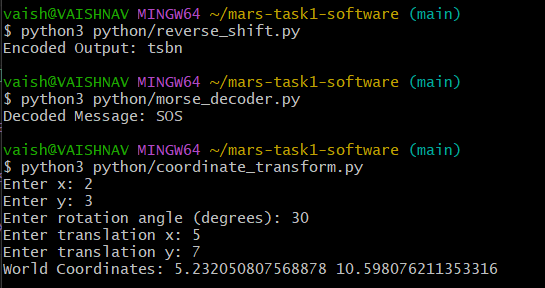
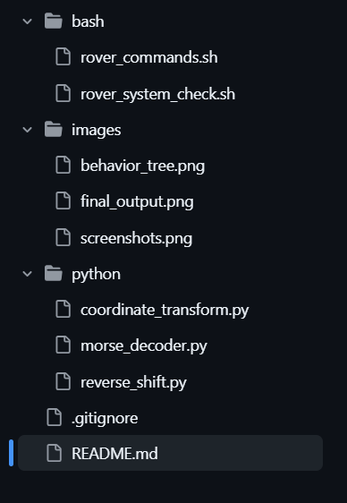

# mars-task1-software
MaRS Recruitment Task-1 Solutions (Software Domain)
# MaRS Task-1 Submission

## Overview
This repository contains my implementation for Task-1 of MaRS recruitment.  
It demonstrates my understanding of Linux commands, Bash scripting, Python problem-solving, and system-level thinking.

---

## Folder Structure

- `bash/` → Contains shell scripts for rover operations  
- `python/` → Contains Python solutions for problem statements  
- `images/` → Contains screenshots and diagrams  
- `.gitignore` → Ignores generated files  

---

## Bash Scripts

### rover_commands.sh
- Creates a rover mission directory  
- Initializes a mission log file  

### rover_system_check.sh
- Simulates rover system checks  
- Verifies battery level and communication status  

---

## Python Implementations

### Coordinate Transformation
- Converts coordinates from camera frame to world frame  
- Uses rotation and translation  

### Morse Code Decoder
- Decodes Morse code into readable text using dictionary mapping  

### Reverse Encoding
- Reverses a string and shifts characters using ASCII values  

### Rover Decision System (Hard Problem)
- Simulates rover decision-making based on:
  - Battery level  
  - Obstacle detection  
  - Signal strength  

---

## Behavior Tree
A behavior tree is used to model rover decision-making:
- If battery is sufficient → continue mission  
- If battery is low → return to base  
- Ensures modular and scalable logic  

---

## Execution Proof

### Script Outputs

### Git Workflow

### Repository Structure

### Behaviour tree

---

## Skills Demonstrated
- Linux command-line usage  
- Bash scripting  
- Python problem solving  
- Git version control (including conflict resolution)  
- System design using behavior trees  

---

## Conclusion
This task helped me understand how software interacts with real-world robotic systems and improved my structured problem-solving approach.

---

## Note
All implementations were developed with a focus on clarity, correctness, and understanding of underlying logic.
